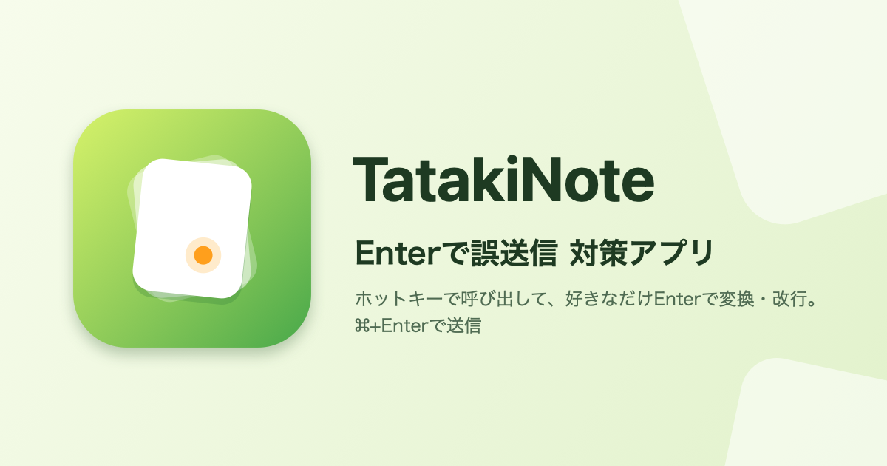
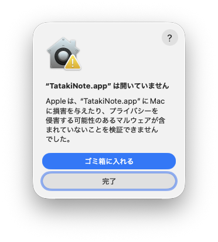
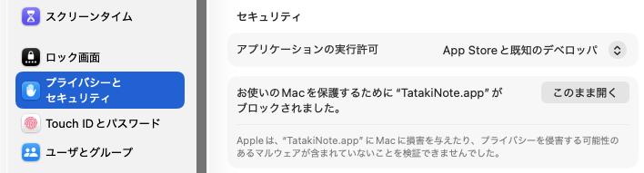
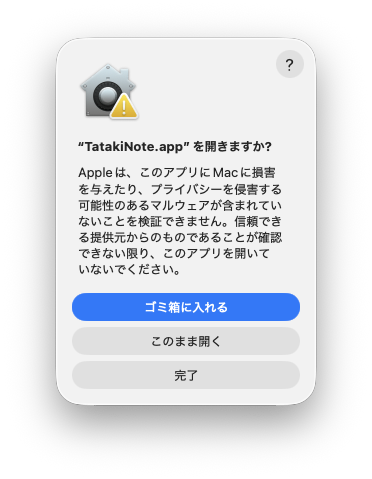
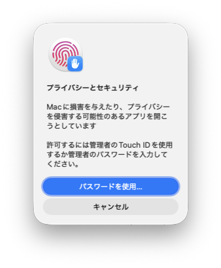

# TatakiNote

### 「Enterで送信する」対策アプリ。 ⌘+↩で送信したい。
ホットキーで呼び出して、好きなだけ Enter で変換・改行。`⌘↩` で送信。

ChatGPT・Claude・Gemini などの AI チャットに送る文章(叩き台)を書くための、メニューバーに常駐する macOS アプリです。

## 書き途中に送信!! 時には変換確定しただけで送信!!

- **変換を確定しようと Enter を押したら、書きかけのプロンプトが送られてしまった**
- **改行のつもりの Enter で、途中までの文章が送られてしまった**
- **長いプロンプトほど、誤送信が怖くて落ち着いて書けない**

AI チャットの入力欄では、Enter を押すと送信されます。日本語は変換の確定にも Enter を使うので、書いている途中で送ってしまいがちです。

## TatakiNote なら

入力欄に直接書かず、手元のパネルで書いてから流し込みます。

1. AI チャットの入力欄をクリックして、ホットキー `⌥⇧Space` を押します。パネルが開きます。
2. パネルで書きます。**Enter はただの改行**なので、変換の確定にも改行にも気兼ねなく使えます。
3. `⌘↩` を押すと、パネルが閉じ、元の入力欄に文章が入って送信されます。

送る前に内容を確かめたいときは、`⇧⌘↩` で入れるだけにして、自分で Enter を押して送ります。

## AI チャットで便利なところ

- **どのアプリでも使えます。** ブラウザの AI チャットでも、Claude や ChatGPT のデスクトップアプリでも使えます。Slack や Discord など、Enter で送るほかのアプリでも同じように使えます。
- **書きかけは残ります。** `esc` でパネルを閉じても、書いた文章は下書きとして残ります。
- **使っていたアプリは前面のままです。** パネルを開いてもフォーカスを奪わないので、そのまま元の入力欄に戻れます。
- **コピーしていた内容は戻ります。** 文章を入れるときにクリップボードを使いますが、入れたあとで元の内容に戻します。
- **長いプロンプトを整えやすい。** 行の入れ替え・複製、行ごとのコピー・切り取り・貼り付けなど、VSCode のような編集のショートカットが使えます。
- **入力欄を選ぶだけで開くこともできます。** 設定の「自動表示」で、選んだアプリの入力欄をクリックしたときにパネルが開くようにできます。
- **キーは変えられます。** ホットキー、確定+挿入キー(入れるだけ)、確定+送信キーは、設定で好きなキーにできます。

## 安心して使えるように

- **TatakiNote は通信をしません。** 書いた文章が TatakiNote から外部のサーバーへ送られることはありません。文章が届くのは、パネルを開いたときに使っていたアプリの入力欄だけです。
- **AI チャットに送るのは、`⌘↩`(Command + Enter)で確定したときだけです。** パネルの中で Enter を押しても、勝手に送信されることはありません。`⌘↩` のキーは設定で変えられます。

## 動作環境

macOS 14 以降

## 入手とインストール

1. [Releases](../../releases) から最新の `TatakiNote-<版>.zip` をダウンロードし、開いて `TatakiNote.app` を取り出します。
2. `TatakiNote.app` を「アプリケーション」フォルダに入れて開きます。
3. 初めて開くときは警告が出ます。次の「[初回だけ必要な許可](#初回だけ必要な許可証明書のないアプリを開く)」の手順で開きます。

### 初回だけ必要な許可(証明書のないアプリを開く)

TatakiNote は Apple の公証(開発元の証明書による確認)を受けていないため、初めて開くときに macOS が警告を出して止めます。アプリが壊れているわけではありません。次の手順で、初回だけ自分で許可します。2 回目からは普通に開けます。

**1. 警告が出たら「完了」を押す**

「“TatakiNote.app” は開いていません」と表示されます。「ゴミ箱に入れる」ではなく、「完了」を押して閉じます。

**2. 「システム設定」で「このまま開く」を押す**

「システム設定」を開き、左の一覧から「プライバシーとセキュリティ」を選びます。下の方の「セキュリティ」に「“TatakiNote.app” がブロックされました。」と出ているので、右の「このまま開く」を押します。

**3. もう一度「このまま開く」を押す**

「“TatakiNote.app” を開きますか?」と確認が出ます。「このまま開く」を押します。

**4. Mac のパスワードで許可する**

「プライバシーとセキュリティ」の確認が出たら、Touch ID か、「パスワードを使用…」から Mac のパスワードを入力して許可します。

許可すると TatakiNote が起動し、メニューバーに現れます。続けて「[最初にやること](#最初にやること)」に進みます。

「システム設定」に「このまま開く」が出ていないときは、手順 1 の警告をもう一度出してから(`TatakiNote.app` をもう一度開く)、探してください。表示されるのは警告が出たあと、しばらくの間だけです。

新しい版に更新するときは、TatakiNote を終了してから同じ手順で「アプリケーション」フォルダの `TatakiNote.app` を置き換えます。アクセシビリティの許可はそのまま引き継がれます。各版の変更点は [Releases](../../releases) に載せています。

## 最初にやること

1. **アクセシビリティを許可する。** 書いた文章を他のアプリに入れるのに要ります。初回の起動時に案内が開くので、手順に沿って許可します。詳しくは[アクセシビリティの許可](docs/features/accessibility.md)を見てください。
2. **チュートリアルで試す。** 許可すると、AI チャット風の練習用のチャットでパネルを開いて書いて送るまでを試せるチュートリアルが開きます。あとから設定の「アプリ情報」でも開けます([チュートリアル](docs/features/tutorial.md))。

## よくある質問

**入力欄に直接書くのと何が違うのですか?**
パネルの中では Enter で送信されないので、変換や改行の途中で送ってしまうことがありません。書き終えて送ると決めたときだけ、`⌘↩` で入れて送ります。

**AI チャットの設定で Enter の動きを変えればよいのでは?**
設定があるアプリもありますが、アプリごとに違い、設定の無いアプリもあります。TatakiNote なら、どのアプリでも同じキーで書けます。

**アクセシビリティの許可は何に使いますか?**
書いた文章を元のアプリの入力欄に入れること(⌘V と Enter を送ること)と、入力欄が選ばれているかを調べることに使います。

## 使い方

機能ごとの説明は[TatakiNote の使い方](docs/README.md)にまとめています。

- [チュートリアル](docs/features/tutorial.md)
- [入力パネル](docs/features/panel.md)
- [入力欄の編集ショートカット](docs/features/text-editing.md)
- [書いた文章を挿入する・送信する](docs/features/insert-and-send.md)
- [入力欄を選んだらパネルを自動で出す](docs/features/auto-show.md)
- [設定ウィンドウ](docs/features/settings.md)

## 開発

開発に参加する方法は [CONTRIBUTING.md](CONTRIBUTING.md)、リリースの手順は [RELEASING.md](RELEASING.md) にまとめています。
